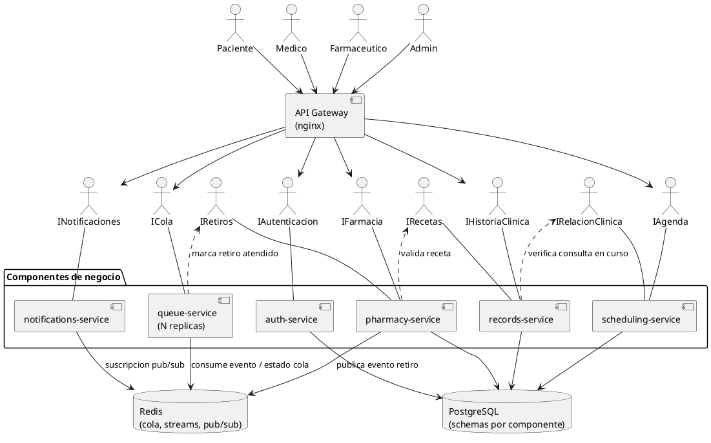

# Parte 1 - Modelo de componentes

## 1. Diagrama de componentes (UML)

## 2. Justificación de la partición de primer nivel

Elegimos **partición técnica por subdominio (estilo microservicios)** en vez de
una partición por capas, por tres razones ligadas a los atributos de calidad del
problema:

1. **Confidencialidad.** La historia clínica queda aislada en un único
   componente (`records-service`) con su propio schema. Ningún otro componente
   accede a esos datos: deben pedirlos por su interfaz, que audita cada acceso.
   En una partición por capas, la capa de datos sería compartida y cualquier
   módulo podría leer la tabla de historias.
2. **Escalabilidad selectiva (HU8).** El pico de demanda no es uniforme: la cola
   se consulta cientos de veces por minuto (cada paciente refresca su posición),
   mientras que reservar una cita ocurre una vez. Con esta partición escalamos
   solo `queue-service`. Con capas habría que replicar el monolito entero.
3. **Diferentes modelos de consistencia.** El mismo sistema necesita ACID
   (citas, recetas) y BASE (cola). Separar componentes permite que cada uno elija
   su motor y su modelo sin comprometer al otro.

## 3. Proceso para encontrar los componentes

1. Partimos de las 8 historias de usuario de UT1/UT2.
2. Agrupamos por **sustantivo del dominio** (cita, historia clínica, receta,
   retiro, turno, aviso) y verificamos con **actor + ritmo de cambio**.
3. Aplicamos el criterio de **cohesión funcional**: lo que cambia junto, va
   junto. La agenda cambia por reglas de negocio del consultorio; la cola cambia
   por reglas de operación de la farmacia. Son ritmos distintos → componentes
   distintos.
4. Verificamos con el criterio de **volatilidad y de consistencia**: todo lo que
   necesitaba transacción quedó del lado PostgreSQL; lo que tolera desfasaje,
   del lado Redis.
5. Validamos trazando cada historia de usuario sobre el diagrama y comprobando
   que ninguna requiera que dos componentes escriban la misma tabla.

| Historia | Componentes involucrados |
|---|---|
| HU1 Reservar cita | auth, scheduling |
| HU2 Retiro + cola virtual | auth, records, pharmacy, queue |
| HU3 Notificación de turno | queue, notifications |
| HU4 Ver historia (paciente) | auth, records |
| HU5 Ver historia (médico) | auth, records, scheduling |
| HU6 Recetar | auth, records, scheduling |
| HU7 Cola de retiros | auth, queue, pharmacy |
| HU8 Estabilidad en picos | gateway, queue (N réplicas) |

## 4. Contenedores vs. máquinas virtuales

**Elegimos contenedores (Docker).** Motivos: arranque en segundos (permite
autoescalar ante el pico de las 8 am), imagen inmutable idéntica en todos los
ambientes, y alta densidad (9 procesos aislados en una notebook).

**Impacto si tuviéramos que usar máquinas virtuales:**

- *Costo y densidad*: cada réplica de `queue-service` consume hoy 128 MB. En VM
  serían ~1 GB solo de sistema operativo. Escalar de 1 a 3 réplicas pasaría de
  ~256 MB a ~3 GB.
- *Tiempo de escalado*: de segundos a 1–3 minutos, lo que hace inviable
  reaccionar al pico; habría que sobredimensionar permanentemente.
- *Despliegue*: perderíamos la imagen inmutable. Necesitaríamos
  Packer/Ansible para construir imágenes doradas, y el despliegue pasaría de
  `docker compose up` a un pipeline de provisioning.
- *Ventaja que ganaríamos*: aislamiento más fuerte (hipervisor vs. namespaces
  del kernel compartido). Para datos clínicos es un argumento real, y en
  producción probablemente usaríamos contenedores **dentro** de VMs dedicadas
  para combinar ambas cosas.

## 5. ACID vs. BASE

**Usamos las dos, cada una donde corresponde.**

- **ACID (PostgreSQL)** para citas, historia clínica, recetas y auditoría. Una
  doble reserva o una receta sin rastro de emisión son inaceptables. Se resuelve
  con transacciones y `SELECT ... FOR UPDATE`.
- **BASE (Redis)** para la cola híbrida y las notificaciones. Un desfasaje de
  200 ms en la posición de la cola no tiene consecuencias clínicas, y a cambio
  ganamos que la cola siga operativa aunque PostgreSQL esté degradado.

**Impacto de usar solo ACID (todo transaccional):**
- Cada `GET /mi-turno` (cientos por minuto) golpearía PostgreSQL. La contención
  de bloqueos sobre la tabla de la cola sería el cuello de botella del sistema,
  justo en el horario pico (rompe HU8).
- Si PostgreSQL se degrada, la cola deja de funcionar y los pacientes vuelven a
  la sala de espera: el problema que el proyecto vino a resolver.

**Impacto de usar solo BASE (todo eventual):**
- Dos pacientes podrían reservar el mismo cupo y la inconsistencia se detectaría
  después, obligando a lógica de compensación (avisar a un paciente que su cita
  se canceló). Inaceptable para la experiencia del paciente.
- Una receta podría quedar sin registro de auditoría, violando el requisito de
  trazabilidad sobre datos sensibles.